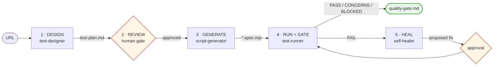

# web-test-agent

**Black-box end-to-end web testing, driven from nothing but a URL.**


Point it at a deployed site. It explores the live pages, scores the risks it finds, proposes
a reviewable test plan, generates Playwright specs from the plan you approve, runs them,
and returns a quality-gate decision you can block a release on.

No access to the target's source code is required, and none is assumed.

---

## Table of contents

- [Why this exists](#why-this-exists)
- [How it works](#how-it-works)
- [Quick start](#quick-start)
- [The five phases](#the-five-phases)
- [The test plan is the contract](#the-test-plan-is-the-contract)
- [Two execution paths: PW and MCP](#two-execution-paths-pw-and-mcp)
- [The quality gate](#the-quality-gate)
- [Artifact layout](#artifact-layout)
- [Configuration](#configuration)
- [Project structure](#project-structure)
- [Guardrails](#guardrails)
- [Troubleshooting](#troubleshooting)

---

## Why this exists

Most test automation starts from the inside: you have the repo, the components, the routes.
This workflow starts from the outside, the way a user or an auditor does. That makes it
useful in the cases where conventional tooling has nothing to grip:

- A deployed site whose source you do not have, or do not want to read.
- A staging environment you need smoke coverage on before a release, today.
- A third-party or legacy app nobody on the team can still explain.
- A regression net around an app while its internals are being rewritten.

The trade-off is deliberate. Black-box tests cannot see why something broke, only that it
did. This workflow compensates with a live-page diagnosis phase rather than pretending the
limitation away.

## How it works

The repository is not an application. It is a **workflow**: four focused Claude Code skills
under [`.claude/skills/`](.claude/skills/), an orchestrator that sequences them, and three
Node scripts they drive.



Two points in that loop are **human gates**, marked in orange. The workflow stops at both.
It will not generate specs from a plan you have not approved, and the healer will not edit a
spec without first explaining, in plain language, what it will change. Everything else runs unattended.

## Quick start

```bash
npm install && npx playwright install chromium
```

Then drive the phases. `BASE_URL` is the only knob you need:

```bash
# 1 · explore the live site and collect evidence
node .claude/skills/test-designer/explore.mjs https://example.com
#     large or login-gated site: crawl it instead (roles and credentials from .env)
node .claude/skills/test-designer/crawl.mjs https://example.com
#     after the agent writes test-plan.md: every route and control covered? (exit 1 = gaps)
node .claude/skills/test-designer/coverage.mjs https://example.com

# 2 · review and edit artifacts/example.com/test-plan.md  (your call, not the agent's)

# 3 · the agent generates artifacts/example.com/tests/*.spec.mjs from the approved table

# 4 · run and gate
BASE_URL=https://example.com npm test
BASE_URL=https://example.com npm run gate
```

Or ask Claude Code to run the whole thing: *"test https://example.com end to end"* invokes
the `web-test` orchestrator, which sequences all five phases and stops at each human gate.

<details>
<summary><b>Windows PowerShell</b></summary>

PowerShell has no inline `VAR=value cmd` prefix. Set the variable first:

```powershell
$env:BASE_URL = "https://example.com"; npm test
$env:BASE_URL = "https://example.com"; npm run gate
```
</details>

<details>
<summary><b>Running a single spec or a single test case</b></summary>

```bash
BASE_URL=https://example.com npx playwright test \
  --config .claude/skills/test-runner/playwright.config.mjs \
  artifacts/example.com/tests/login.spec.mjs

# by test case id
BASE_URL=https://example.com npx playwright test \
  --config .claude/skills/test-runner/playwright.config.mjs -g "TC-003"

# open the HTML report
npx playwright show-report artifacts/example.com/html-report
```
</details>

## The five phases

| # | Phase | Skill | What happens | Output |
|---|---|---|---|---|
| 1 | DESIGN | [`test-designer`](.claude/skills/test-designer/SKILL.md) | Drives headless Chromium over the live site, captures evidence, scores risk (probability x impact), writes a test plan that covers every route and control it found (`coverage.mjs` checks) | `test-plan.md`, `coverage.md`, `exploration.md`, `screenshot.png`, `console.json`, `network.json`; with the crawler, `crawl/site-map.md` |
| 2 | REVIEW | *human* | You edit and approve the test-case table. It is the source of truth downstream | the edited table |
| 3 | GENERATE | [`script-generator`](.claude/skills/script-generator/SKILL.md) | Turns each `Tool=PW` row into an idiomatic Playwright test | `tests/*.spec.mjs` |
| 4 | RUN + GATE | [`test-runner`](.claude/skills/test-runner/SKILL.md) | Runs the specs, drives `Tool=MCP` cases live, merges both, decides the gate, reports back | `results.json`, `mcp-results.json`, `quality-gate.md`, `html-report/` |
| 5 | HEAL | [`self-healer`](.claude/skills/self-healer/SKILL.md) | On failure only: reproduces on the live page, separates real bugs from broken scripts, explains each fix in plain language | `heal-proposal.md`, pending approval |

[`web-test`](.claude/skills/web-test/SKILL.md) is the orchestrator that sequences them;
[`checklist.md`](.claude/skills/web-test/checklist.md) is the exit criteria to run through
before calling a session done.

Each skill carries its own reference material under `resources/knowledge/` —
risk scoring, test levels, selector resilience, and gate semantics.

## The test plan is the contract

Everything downstream reads one Markdown table in `artifacts/<host>/test-plan.md`:

| TC | P | Tool | Mô tả | Các bước | Kỳ vọng | Status |
|---|---|---|---|---|---|---|
| TC-001 | P0 | PW | Đăng nhập hợp lệ | 1. Mở /login; 2. Điền email + mật khẩu; 3. Bấm Sign in | Chuyển tới /dashboard, hiện tên người dùng | (pending) |
| TC-010 | P1 | MCP | Kéo thả thẻ trên bảng | 1. Mở /board; 2. Kéo thẻ A sang cột Done | Thẻ nằm ở cột Done sau khi reload | (pending) |

The plan template and worked examples are written in Vietnamese; keep new plans in the same
language as [the template](.claude/skills/test-designer/templates/test-cases.template.md).
Multi-step cells separate steps with `;`.

There is no parser. Generation is judgement-driven, so the table's *meaning* matters more
than its exact formatting — which is precisely what makes it safe for you to edit by hand.
Add a row, drop one, rewrite an expectation: the next phase reads what you left behind.

> **The one rigid convention:** generated test titles must encode the case id and priority as
> `TC-001 [P0] <description>`. The gate parses traceability straight out of the title, and a
> test that does not match loses its row and silently defaults to P1.

## Two execution paths: PW and MCP

The `Tool` column routes each case to the mechanism that actually suits it.

| | `PW` — Playwright spec | `MCP` — live chrome-devtools |
|---|---|---|
| **Runs as** | A generated `test()` in `tests/*.spec.mjs` | The agent driving a real browser, step by step |
| **Best for** | Deterministic flows: auth, forms, navigation, validation | Heavy dynamic DOM, canvas, drag-and-drop, anything needing live inspection |
| **Results land in** | `results.json` (Playwright JSON reporter) | `mcp-results.json` (recorded by the agent) |
| **Cost** | Fast, repeatable, CI-friendly | Slower, needs the MCP server connected |

A single plan can mix both freely. `report.mjs` merges the two result files into one
traceability matrix, so a `Tool=MCP` case is a first-class citizen of the gate rather than a
footnote.

Requires the `chrome-devtools` MCP server, configured in [`.mcp.json`](.mcp.json). If it is not
connected, the Playwright cases still run and the MCP cases are reported as skipped —
explicitly, never silently.

## The quality gate

`report.mjs` merges every result into `artifacts/<host>/quality-gate.md` and returns one of
four decisions, evaluated in order:

| Decision | Condition | Meaning |
|---|---|---|
| **FAIL** | Any P0 case failed | Block the release |
| **BLOCKED** | No P0 failed, but a P0 case was *skipped* | Nothing is known to be broken — a P0 case simply could not be verified. Verify it another way before release |
| **CONCERNS** | P0 all green, but P1 below 95%, or P2/P3 failures, or any remaining skip | Ship with monitoring and a remediation backlog |
| **PASS** | Every case executed and passed | Ship it |

P0 admits no exceptions: the threshold is 100 percent. P1 is 95 percent. P2 and P3 are
informational — tracked, never blocking. `report.mjs` **exits 1 on FAIL and 2 on BLOCKED**,
so CI or an orchestrating agent can gate a pipeline on either while still telling a real
defect apart from an unverified case.

**Skipped is a third verdict, not a quiet failure.** A case blocked by a tool or environment
limit — no real device, a native browser dialog the driver cannot accept, a missing
precondition — is recorded as `status: "skipped"` with a `note` saying why. Pass rate is
`passed / (total − skipped)`: a case that never ran is evidence for nothing, so it leaves the
denominator rather than being scored against the app. It appears in the traceability matrix as
⏭️ SKIP and gets its own *Not verified* section in the report, notes included. A priority whose
cases were all skipped reports `—`, never `100%`.

A human may record a `WAIVED` override of a FAIL for a documented business reason, with an
approver, an expiry, and a remediation date. It is never decided automatically.

## Artifact layout

One domain, one self-contained bundle. The host comes from `BASE_URL`, sanitized so
`localhost:3000` becomes `localhost_3000`.

```
artifacts/example.com/
├── test-plan.md         # the contract you approved; the gate fills in its Status column
├── tests/               # committed — the generated specs
│   └── login.spec.mjs
├── exploration.md       # regenerated — what the explorer found
├── screenshot.png       # regenerated
├── console.json         # regenerated — console errors and warnings
├── network.json         # regenerated — request log, failures flagged
├── coverage.md          # regenerated — what the plan covers, gaps first
├── crawl/               # regenerated — crawl.mjs output
│   ├── site-map.md      #   templates, files, access matrix, bundle routes, health, warnings
│   ├── site-map.json    #   the same, untruncated
│   └── pages/<url>/     #   exploration.md + screenshot.png per template
├── .auth/<role>.json    # regenerated — saved login sessions (live tokens)
├── results.json         # regenerated — Playwright output
├── mcp-results.json     # regenerated — live-driven case verdicts
├── quality-gate.md      # regenerated — the decision
├── heal-proposal.md     # the healer's plain-language proposal; archived with a date on the next run
└── html-report/         # regenerated
```

`artifacts/` is gitignored in full. This repo publishes the workflow — the skills and the
scripts they drive — not the output of any run: a bundle describes one specific target site,
its surface and its findings, so it stays on the machine that produced it. Run phase 1 against
any URL and you get your own bundle in this shape.

## Configuration

| Variable | Purpose |
|---|---|
| `BASE_URL` | **Required for phases 4 and 5.** Sets the Playwright `baseURL` and resolves `artifacts/<host>/`. Specs navigate with `page.goto('/')`, never absolute URLs |
| `WEBTEST_HOST` | Overrides the host derived from `BASE_URL`, when the bundle name should differ from the target |
| `TEST_EMAIL`, `TEST_PASSWORD` | Test-account credentials for the default role. Read from the environment, never written into a plan or a spec |
| `WEBTEST_ROLES` | Roles `crawl.mjs` logs in as, comma-separated (e.g. `admin,user`). Role `X` reads `TEST_X_EMAIL` / `TEST_X_PASSWORD` |
| `WEBTEST_LOGIN_PATH` | Login page path for `crawl.mjs`, default `/login` |

Copy [`.env.example`](.env.example) to `.env`, or to `.env.<host>` for credentials that belong
to one site (read first, wins over `.env`). Both the crawler and the Playwright config load
them; variables set in the shell win. `.env*` is gitignored — credentials never reach a commit.

Cross-browser and mobile projects are pre-declared and commented out in
[`playwright.config.mjs`](.claude/skills/test-runner/playwright.config.mjs) — uncomment to
widen coverage beyond Chromium.

## Guardrails

The parts of this workflow that exist to keep it honest:

- **A failing test is a hypothesis, not a verdict.** The healer reproduces on the live page
  and decides whether it found a real application bug or a broken script. A real bug gets
  reported with evidence. It is never "healed" into passing.
- **Nothing is applied without approval.** The healer explains the fix in plain language and waits.
- **Locators are role- and label-based.** `getByRole` and `getByLabel` over brittle CSS;
  web-first assertions over `waitForTimeout` as a synchronisation mechanism. See
  [`selector-resilience.md`](.claude/skills/script-generator/resources/knowledge/selector-resilience.md).
- **Credentials live in the environment.** Never in a plan, a spec, or a commit.
- **Data-mutating cases run against staging.** Production gets read-only and negative checks.
- **Whoever writes the data cleans it up.** A Playwright spec has `afterEach` and fixtures; an
  agent-driven `Tool=MCP` case has nothing but this rule — delete what it created and restore
  what it changed as soon as the verdict is recorded, and repeat the cleanup step in the case's
  own run instructions.
- **Skips are stated out loud.** A case that could not run is reported as skipped with a
  reason — never silently scored as a failure, never quietly dropped from the report.
- **Cases follow risk, not volume.** A plan is not padded with tests no risk justifies.

## Troubleshooting

| Symptom | Cause and fix |
|---|---|
| Explorer times out after 30s | `explore.mjs` waits for `networkidle`, which never settles on websocket or long-poll sites. It still captures what loaded and logs the error — switch that site to chrome-devtools MCP |
| `No host. Set BASE_URL=...` | `report.mjs` cannot tell which bundle to read. Set `BASE_URL`, or pass the host as the first argument |
| No specs found, run is empty | The host derived from `BASE_URL` does not match the bundle directory. Check for a port or character the sanitizer rewrote, or set `WEBTEST_HOST` |
| A case is missing from the gate | Its test title does not match `TC-NNN [Pn] ...`, so it lost its traceability row |
| Empty button label in the exploration outline | An icon-only button. Target its `aria-label`, not its text |
| MCP cases all reported as skipped | The `chrome-devtools` MCP server is not connected. It must be declared in [`.mcp.json`](.mcp.json) — a plain `mcp.json` is not read — and servers only load at session start, so restart the session after adding it |
| A button sits on `Starting...` forever, no console error | The page called `getUserMedia`/`getDisplayMedia` and the browser's native "Choose what to share" picker is waiting outside the DOM, where no snapshot sees it and no click reaches it. `.mcp.json` launches Chrome with `--use-fake-ui-for-media-stream` and `--auto-select-desktop-capture-source` to answer it automatically — effective from the next session. See [`media-capture-cases.md`](.claude/skills/test-runner/resources/knowledge/media-capture-cases.md). It is never an application bug |
| `crawl.mjs` exits with `login failed ... field-not-found` | The login form is not at `/login`, or its fields have no email/password label. Set `WEBTEST_LOGIN_PATH`; SSO and MFA logins are not supported |
| `site-map.md` opens with a Warning | The crawl stopped early (page or time limit, rate limiting, a session that kept expiring). Raise `--max-pages` / `--max-minutes`, or narrow the crawl with `--exclude` |

---

## Requirements

Node 20.12 or later (21 or later for `npm run test:unit`), and Chromium via `npx playwright install chromium`. The `chrome-devtools`
MCP server is optional, and required only for `Tool=MCP` cases and live-page healing.

For working conventions and the internal contracts between phases, see [CLAUDE.md](CLAUDE.md).
