# web-test-agent

**Black-box end-to-end web testing, driven from nothing but a URL.**


Point it at a deployed site, and hand it the requirement documents you have. It follows a
tester's process — analyse the requirements, design the test cases, execute them, analyse the
results — and stops after each step for you to review and approve. You end up with
requirements traced to test cases, a quality-gate decision you can block a release on, and a
bug report ready to import into Jira.

No access to the target's source code is required, and none is assumed.

---

## Table of contents

- [Why this exists](#why-this-exists)
- [How it works](#how-it-works)
- [Quick start](#quick-start)
- [The four steps](#the-four-steps)
- [Approval gates](#approval-gates)
- [The test plan is the contract](#the-test-plan-is-the-contract)
- [Two execution paths: PW and MCP](#two-execution-paths-pw-and-mcp)
- [The quality gate](#the-quality-gate)
- [Artifact layout](#artifact-layout)
- [Configuration](#configuration)
- [Project structure](#project-structure)
- [Guardrails](#guardrails)
- [Troubleshooting](#troubleshooting)

---

## Why this exists

Most test automation starts from the inside: you have the repo, the components, the routes.
This workflow starts from the outside, the way a user or an auditor does. That makes it
useful in the cases where conventional tooling has nothing to grip:

- A deployed site whose source you do not have, or do not want to read.
- A staging environment you need smoke coverage on before a release, today.
- A third-party or legacy app nobody on the team can still explain.
- A regression net around an app while its internals are being rewritten.

The trade-off is deliberate. Black-box tests cannot see why something broke, only that it
did. This workflow compensates with a live-page diagnosis phase rather than pretending the
limitation away.

## How it works

The repository is not an application. It is a **workflow**, packaged as a Claude Code plugin:
six focused skills under [`plugins/web-test-agent/skills/`](plugins/web-test-agent/skills/), an orchestrator that
sequences them, a `setup` skill, and the Node scripts they drive. It follows a tester's four steps, and each step ends at an approval gate.

```mermaid
flowchart LR
    U([URL + documents]) --> A[1 · REQUIREMENTS<br/>requirement-analyst]
    A -->|requirements.md| G1{G1}
    G1 --> D[2 · DESIGN<br/>test-designer]
    D -->|test-plan.md| G2{G2}
    G2 --> E[3 · EXECUTE<br/>script-generator · test-runner · self-healer]
    E -->|quality-gate.md| G3{G3}
    G3 --> R[4 · ANALYSE<br/>result-analyst]
    R -->|bug-report.md| G4{G4}
    G4 --> J([bugs.csv → Jira])

    style G1 fill:#fff4e6,stroke:#d97757,stroke-width:2px
    style G2 fill:#fff4e6,stroke:#d97757,stroke-width:2px
    style G3 fill:#fff4e6,stroke:#d97757,stroke-width:2px
    style G4 fill:#fff4e6,stroke:#d97757,stroke-width:2px
    style J fill:#e8f5e9,stroke:#2ead33,stroke-width:2px
```



The four orange diamonds are **approval gates**. The workflow stops at each one, and the
scripts of the next step refuse to run until you approve (see [Approval gates](#approval-gates)).
Inside step 3 the healer also never edits a spec without first explaining, in plain language,
what it will change. Everything else runs unattended.

## Quick start

### Install (testers)

Once per machine, in a terminal:

```bash
claude plugin marketplace add phamvanhoang9/web-test-agent
```

```bash
claude plugin install web-test-agent@web-test-agent
```

Then open Claude Code in any folder you want to work in and run `/web-test-agent:setup`. It
installs Playwright and Chromium into that folder, creates `artifacts/` and `.gitignore`, and
checks the chrome-devtools MCP server; approve the one settings file it asks to write. After
that, ask for what you need: *"test https://example.com end to end"*.

Your work folder holds the bundles (`artifacts/<host>/`) and credentials (`<host>.env`); the
plugin holds the workflow. Updates arrive when the maintainer publishes a new version, and the
work folder needs no change.

### Develop (this repo)

```bash
npm install && npx playwright install chromium
```

```bash
claude --plugin-dir ./plugins/web-test-agent
```

The commands below are the developer shortcuts in this repo's `package.json`. Testers never
type them: the skills call the same scripts from the installed plugin. `BASE_URL` is the only
knob you need:

```bash
# where does this site stand? (the four gates and the next step)
npm run status -- https://example.com

# 1 · requirements: tell the agent where your documents are (any folder on your machine),
#     it explores the site and writes requirements.md  →  you review and approve (G1)
node plugins/web-test-agent/skills/test-designer/explore.mjs https://example.com
#     large or login-gated site: crawl it instead (roles and credentials from .env)
node plugins/web-test-agent/skills/test-designer/crawl.mjs https://example.com
#     options: crawl.mjs --roles admin,user --max-pages 200 --max-minutes 15 --exclude <regex>
#              explore.mjs --steps steps.json  (click through a flow before capturing)

# 2 · design: the agent writes test-plan.md; every route, control and requirement covered?
npm run coverage -- https://example.com          # exit 1 = gaps, 3 = G1 not approved
#     →  you review and approve (G2)

# 3 · execute: the agent generates artifacts/example.com/tests/*.spec.mjs, then
BASE_URL=https://example.com npm test            # refuses to start before G2
BASE_URL=https://example.com npm run gate        # quality-gate.md  →  you approve (G3)

# 4 · analyse: the agent writes bug-report.md  →  you approve (G4), then
npm run bugs -- https://example.com              # bugs.csv for Jira
```

Or ask Claude Code to run the whole thing: *"test https://example.com end to end"* invokes
the `web-test` orchestrator, which sequences all four steps and stops at each gate.

<details>
<summary><b>Windows PowerShell</b></summary>

PowerShell has no inline `VAR=value cmd` prefix. Set the variable first:

```powershell
$env:BASE_URL = "https://example.com"; npm test
$env:BASE_URL = "https://example.com"; npm run gate
```
</details>

<details>
<summary><b>Running a single spec or a single test case</b></summary>

```bash
BASE_URL=https://example.com npx playwright test \
  --config plugins/web-test-agent/skills/test-runner/playwright.config.mjs \
  artifacts/example.com/tests/login.spec.mjs

# by test case id
BASE_URL=https://example.com npx playwright test \
  --config plugins/web-test-agent/skills/test-runner/playwright.config.mjs -g "TC-003"

# open the HTML report
npx playwright show-report artifacts/example.com/html-report
```
</details>

## The four steps

| # | Step | Skill | What happens | You approve |
|---|---|---|---|---|
| 1 | REQUIREMENTS | [`requirement-analyst`](plugins/web-test-agent/skills/requirement-analyst/SKILL.md) | Reads the documents you point it to (anywhere on your machine; your path in the chat is the access confirmation, and they are read in place, not copied), drives headless Chromium over the live site (`explore.mjs` / `crawl.mjs`), and turns both into testable requirements. What no document covers is inferred from the site and marked as such; business rules it can only guess become questions for the PO | `requirements.md` (G1) |
| 2 | DESIGN | [`test-designer`](plugins/web-test-agent/skills/test-designer/SKILL.md) | Scores risk (probability x impact) and writes a test plan linked to the requirements, covering every requirement, route and control (`coverage.mjs` checks) | `test-plan.md` (G2) |
| 3 | EXECUTE | [`script-generator`](plugins/web-test-agent/skills/script-generator/SKILL.md), [`test-runner`](plugins/web-test-agent/skills/test-runner/SKILL.md), [`self-healer`](plugins/web-test-agent/skills/self-healer/SKILL.md) | Turns each `Tool=PW` row into a Playwright test, runs the specs, drives `Tool=MCP` cases live, merges both into the quality gate. On failure the healer reproduces on the live page and separates real bugs from broken scripts | `quality-gate.md` (G3) |
| 4 | ANALYSE | [`result-analyst`](plugins/web-test-agent/skills/result-analyst/SKILL.md) | Writes the bug report — one bug per cause, ids stable across runs, evidence saved — and a release recommendation, then exports approved bugs to a Jira CSV | `bug-report.md` (G4) |

[`web-test`](plugins/web-test-agent/skills/web-test/SKILL.md) is the orchestrator that sequences them;
[`checklist.md`](plugins/web-test-agent/skills/web-test/checklist.md) is the exit criteria to run through
before calling a session done.

**Inferred is not required.** A requirement inferred from the site describes what it *does*,
not what it *must* do, so each one carries a status: `Đã xác nhận` (from a document, or a
standard every site must meet), `Chấp nhận tạm` (obvious behaviour, not yet confirmed — a
passing test only shows the site has not changed), `Cần hỏi` (a business rule only the PO can
confirm; no test case until answered) or `Bỏ` (no longer applies).

## Approval gates

Each gated file carries one line under its title, and a short "Việc của bạn trước khi duyệt"
block telling you what to check this time:

```
> **Duyệt:** ⬜ Chờ duyệt
> **Duyệt:** ✅ Đã duyệt — Nguyễn Văn A — 2026-09-28 14:30
```

You approve by editing that line, or by saying "duyệt" to the agent, which writes it for you —
never on its own initiative. A gate passes when its file is approved, the previous gate passes,
and it was approved no earlier than the previous one: approve the requirements again and the
test plan needs a new approval too. G3 also needs every failed test case classified by the
healer. Any content change the agent makes to an approved file resets its line.

`npm run status -- <url>` shows the four gates and the next step. A script blocked by a gate
exits **3** and names the gate and the reason.

Each skill carries its own reference material under `resources/knowledge/` —
risk scoring, test levels, selector resilience, and gate semantics.

## The test plan is the contract

Everything downstream reads one Markdown table in `artifacts/<host>/test-plan.md`:

| TC | REQ | P | Tool | Mô tả | Các bước | Kỳ vọng | Status |
|---|---|---|---|---|---|---|---|
| TC-001 | REQ-001 | P0 | PW | Đăng nhập hợp lệ | 1. Mở /login; 2. Điền email + mật khẩu; 3. Bấm Sign in | Chuyển tới /dashboard, hiện tên người dùng | (pending) |
| TC-010 | REQ-007, REQ-008 | P1 | MCP | Kéo thả thẻ trên bảng | 1. Mở /board; 2. Kéo thẻ A sang cột Done | Thẻ nằm ở cột Done sau khi reload | (pending) |

The `REQ` column links each case to the requirements it checks (`—` for technical checks
such as console errors). It comes from the requirement table in `requirements.md`
(`REQ | Nhóm | Mô tả | Nguồn | Trạng thái | Xác nhận bởi`), which is the contract of step 1;
`coverage.mjs` reports which requirements have no case, and the quality gate reports each
requirement's result.

The templates and worked examples are written in Vietnamese; keep new plans in the same
language as [the template](plugins/web-test-agent/skills/test-designer/templates/test-cases.template.md).
Multi-step cells separate steps with `;`.

There is no parser. Generation is judgement-driven, so the table's *meaning* matters more
than its exact formatting — which is precisely what makes it safe for you to edit by hand.
Add a row, drop one, rewrite an expectation: the next phase reads what you left behind.

> **The one rigid convention:** generated test titles must encode the case id and priority as
> `TC-001 [P0] <description>`. The gate parses traceability straight out of the title, and a
> test that does not match loses its row and silently defaults to P1.

## Two execution paths: PW and MCP

The `Tool` column routes each case to the mechanism that actually suits it.

| | `PW` — Playwright spec | `MCP` — live chrome-devtools |
|---|---|---|
| **Runs as** | A generated `test()` in `tests/*.spec.mjs` | The agent driving a real browser, step by step |
| **Best for** | Deterministic flows: auth, forms, navigation, validation | Heavy dynamic DOM, canvas, drag-and-drop, anything needing live inspection |
| **Results land in** | `results.json` (Playwright JSON reporter) | `mcp-results.json` (recorded by the agent) |
| **Cost** | Fast, repeatable, CI-friendly | Slower, needs the MCP server connected |

A single plan can mix both freely. `report.mjs` merges the two result files into one
traceability matrix, so a `Tool=MCP` case is a first-class citizen of the gate rather than a
footnote.

Requires the `chrome-devtools` MCP server, which ships with the plugin
([`.mcp.json`](plugins/web-test-agent/.mcp.json)). If it is not
connected, the Playwright cases still run and the MCP cases are reported as skipped —
explicitly, never silently.

## The quality gate

`report.mjs` merges every result into `artifacts/<host>/quality-gate.md` — written in
Vietnamese, because it is what you approve at G3 — and returns one of four decisions,
evaluated in order:

| Decision | Condition | Meaning |
|---|---|---|
| **FAIL** | Any P0 case failed | Block the release |
| **BLOCKED** | No P0 failed, but a P0 case was *skipped* | Nothing is known to be broken — a P0 case simply could not be verified. Verify it another way before release |
| **CONCERNS** | P0 all green, but P1 below 95%, or P2/P3 failures, or any remaining skip | Ship with monitoring and a remediation backlog |
| **PASS** | Every case executed and passed | Ship it |

P0 admits no exceptions: the threshold is 100 percent. P1 is 95 percent. P2 and P3 are
informational — tracked, never blocking. `report.mjs` **exits 1 on FAIL, 2 on BLOCKED and 3
when the test plan is not approved (G2)**, so CI or an orchestrating agent can gate a pipeline
on each while still telling a real defect apart from an unverified case.

The report reads top-down, from what to look at to detail: what to check before approving,
the decision, **what changed since the last run** (new failures first; each run is kept in
`runs/<runId>.json`, and a test case whose result flipped twice in the last five runs is
flagged as unstable), the failed and skipped cases, **requirement coverage**, the per-priority
table, the TC → result table, and an appendix with spec locations and a YAML block for CI.

Each requirement gets one result from its test cases: **Đạt** (all ran and passed),
**Không đạt** (one failed), **Chưa kiểm chứng** (one skipped or missing), **Chưa chạy** or
**Không có TC**. Requirements are grouped by status, and a pass on a `Chấp nhận tạm`
requirement is labelled for what it is: a regression baseline, not proof the site is right.
Requirement results do not change the decision — a failing requirement already failed its
test cases.

**Skipped is a third verdict, not a quiet failure.** A case blocked by a tool or environment
limit — no real device, a native browser dialog the driver cannot accept, a missing
precondition — is recorded as `status: "skipped"` with a `note` saying why. Pass rate is
`passed / (total − skipped)`: a case that never ran is evidence for nothing, so it leaves the
denominator rather than being scored against the app. It appears in the traceability matrix as
⏭️ and gets its own *Chưa kiểm chứng* section in the report, notes included. A priority whose
cases were all skipped reports `—`, never `100%`.

A human may record a `WAIVED` override of a FAIL for a documented business reason, with an
approver, an expiry, and a remediation date. It is never decided automatically.

## Artifact layout

One domain, one self-contained bundle. The host comes from `BASE_URL`, sanitized so
`localhost:3000` becomes `localhost_3000`.

```
artifacts/example.com/
├── requirements/        # optional drop folder for requirement documents (docx, pdf, md, xlsx); they may live anywhere
├── requirements.md      # step 1, approved at G1 — testable requirements, flows, questions
├── test-plan.md         # step 2, approved at G2; the gate fills in its Status column
├── tests/               # committed — the generated specs
│   └── login.spec.mjs
├── exploration.md       # regenerated — what the explorer found
├── screenshot.png       # regenerated
├── console.json         # regenerated — console errors and warnings
├── network.json         # regenerated — request log, failures flagged
├── coverage.md          # regenerated — what the plan covers, gaps first
├── crawl/               # regenerated — crawl.mjs output
│   ├── site-map.md      #   templates, files, access matrix, bundle routes, health, warnings
│   ├── site-map.json    #   the same, untruncated
│   └── pages/<url>/     #   exploration.md + screenshot.png per template
├── .auth/<role>.json    # regenerated — saved login sessions (live tokens)
├── results.json         # regenerated — Playwright output
├── mcp-results.json     # regenerated — live-driven case verdicts
├── quality-gate.md      # regenerated — the decision, approved at G3
├── runs/<runId>.json    # one snapshot per run — what the comparison reads
├── heal-proposal.md     # the healer's plain-language proposal; archived with a date on the next run
├── bug-report.md        # step 4, approved at G4 — bugs, recommendation
├── bugs/BUG-NNN/        # each bug's screenshot and trace, kept after test-results/ is emptied (attach only the screenshot to Jira: a trace holds the typed test password and tokens)
├── bugs.csv             # exported after G4, for Jira
└── html-report/         # regenerated
```

`artifacts/` is gitignored in full. This repo publishes the workflow — the skills and the
scripts they drive — not the output of any run: a bundle describes one specific target site,
its surface and its findings, so it stays on the machine that produced it — and so do the
client's requirement documents. Run step 1 against any URL and you get your own bundle in
this shape.

## Configuration

| Variable | Purpose |
|---|---|
| `BASE_URL` | **Required for step 3.** Sets the Playwright `baseURL` and resolves `artifacts/<host>/`. Specs navigate with `page.goto('/')`, never absolute URLs |
| `WEBTEST_HOST` | Overrides the host derived from `BASE_URL`, when the bundle name should differ from the target |
| `TEST_EMAIL`, `TEST_PASSWORD` | Test-account credentials for the default role. Read from the environment, never written into a plan or a spec |
| `WEBTEST_ROLES` | Roles `crawl.mjs` logs in as, comma-separated (e.g. `admin,user`). Role `X` reads `TEST_X_EMAIL` / `TEST_X_PASSWORD` |
| `WEBTEST_LOGIN_PATH` | Login page path for `crawl.mjs`, default `/login` |

Copy [`.env.example`](.env.example) to `.env`, or to `<host>.env` (for example
`app.example.com.env`) for credentials that belong to one site (read first, wins over `.env`).
Both the crawler and the Playwright config load them; variables set in the shell win. `.env*`
and `*.env` are gitignored — credentials never reach a commit. The older name `.env.<host>` is
no longer read: rename such a file to `<host>.env`.

Cross-browser and mobile projects are pre-declared and commented out in
[`playwright.config.mjs`](plugins/web-test-agent/skills/test-runner/playwright.config.mjs) — uncomment to
widen coverage beyond Chromium.

## Project structure

The repo is its own plugin marketplace: [`.claude-plugin/marketplace.json`](.claude-plugin/marketplace.json)
lists one plugin, [`plugins/web-test-agent/`](plugins/web-test-agent/). Nothing test-related lives at the repo
root except `package.json`; everything is under `plugins/web-test-agent/skills/`, one folder per skill.
The Node scripts sit next to the skill that owns them.

```
plugins/web-test-agent/
├── .claude-plugin/plugin.json   # name and version of the plugin
├── .mcp.json                    # chrome-devtools MCP server and its media flags
└── skills/

plugins/web-test-agent/skills/
├── setup/               # once per work folder: Playwright, Chromium, .gitignore, MCP check
├── web-test/            # orchestrator: SKILL.md, checklist.md
│   ├── gate.mjs         #   npm run status — the four gates and the next step
│   └── lib/             #   approval.mjs (the only reader of "Duyệt"), requirements.mjs
├── requirement-analyst/ # step 1: SKILL.md, requirements template and examples
├── test-designer/       # step 2: SKILL.md, plan template, examples, resources/knowledge
│   ├── explore.mjs      #   one page: outline, screenshot, console, network
│   ├── crawl.mjs        #   whole site, several roles -> crawl/site-map.md
│   ├── coverage.mjs     #   plan vs requirements and exploration -> coverage.md
│   └── lib/             #   bundle, capture, auth, site-map, route-discovery, url-template,
│                        #   playwright (loads Playwright from the work folder)
├── script-generator/    # step 3: SKILL.md, spec templates, selector-resilience.md
├── test-runner/         # step 3: SKILL.md, resources/knowledge
│   ├── playwright.config.mjs
│   ├── report.mjs       #   npm run gate — merge results into the quality gate
│   └── lib/             #   history (runs/), req-coverage
├── self-healer/         # step 3, on failure: SKILL.md, resources/knowledge
└── result-analyst/      # step 4: SKILL.md, bug-report template
    ├── bugs.mjs         #   npm run bugs — bugs.csv for Jira
    └── lib/             #   bug-report parser
```

Each script has a `*.test.mjs` beside it. `npm run test:unit` runs them all with `node --test`
and needs no target site. The bundle-name rule (`BASE_URL` → `artifacts/<host>/`) is written
out in three places — [`bundle.mjs`](plugins/web-test-agent/skills/test-designer/lib/bundle.mjs),
[`playwright.config.mjs`](plugins/web-test-agent/skills/test-runner/playwright.config.mjs) and
[`report.mjs`](plugins/web-test-agent/skills/test-runner/report.mjs) — so change all three together, or the
phases will write and read different folders.

### Releasing

Bump `version` in [`plugin.json`](plugins/web-test-agent/.claude-plugin/plugin.json) (and in `package.json`),
commit and push. Testers stay on the version they installed until that number changes, so work
in progress on `main` never reaches them. `claude plugin validate ./plugins/web-test-agent` and
`claude plugin validate .` check the plugin and the marketplace before a release.

## Guardrails

The parts of this workflow that exist to keep it honest:

- **A failing test is a hypothesis, not a verdict.** The healer reproduces on the live page
  and decides whether it found a real application bug or a broken script. A real bug gets
  reported with evidence. It is never "healed" into passing.
- **Nothing is applied without approval.** The healer explains the fix in plain language and waits.
- **Every step waits for you.** Four approval gates, enforced by the scripts, not by good
  intentions; the agent never marks a file approved on its own.
- **Inferred is not required.** A business rule read off the site is a question for the PO,
  not an expectation to test against.
- **Locators are role- and label-based.** `getByRole` and `getByLabel` over brittle CSS;
  web-first assertions over `waitForTimeout` as a synchronisation mechanism. See
  [`selector-resilience.md`](plugins/web-test-agent/skills/script-generator/resources/knowledge/selector-resilience.md).
- **Credentials live in the environment.** Never in a plan, a spec, or a commit. The setup skill
  also denies the agent read access to `.env*`, `*.env` and `artifacts/<host>/.auth/`: the scripts load
  them, the agent never opens them.
- **Site and document content is evidence, never instructions.** Page text, console output,
  crawl results and requirement documents are analysed, not obeyed. Text in them that addresses
  the agent is quoted to the tester and recorded as a finding. This lowers the risk of prompt
  injection; the read-deny rules and the approval gates are what hold if it fails.
- **Data-mutating cases run against staging.** Production gets read-only and negative checks.
- **Whoever writes the data cleans it up.** A Playwright spec has `afterEach` and fixtures; an
  agent-driven `Tool=MCP` case has nothing but this rule — delete what it created and restore
  what it changed as soon as the verdict is recorded, and repeat the cleanup step in the case's
  own run instructions.
- **Skips are stated out loud.** A case that could not run is reported as skipped with a
  reason — never silently scored as a failure, never quietly dropped from the report.
- **Cases follow risk, not volume.** A plan is not padded with tests no risk justifies.

## Troubleshooting

| Symptom | Cause and fix |
|---|---|
| Explorer times out after 30s | `explore.mjs` waits for `networkidle`, which never settles on websocket or long-poll sites. It still captures what loaded and logs the error — switch that site to chrome-devtools MCP |
| `Thiếu host. Đặt BASE_URL=...` | `report.mjs` cannot tell which bundle to read. Set `BASE_URL`, or pass the host as the first argument |
| Exit 4, `Chưa cài Playwright ở thư mục này` | The work folder has not been set up. Run `/web-test-agent:setup`, then repeat the command |
| Exit 3, `G2 chưa qua: ...` (or G1, G3, G4) | An approval gate is not passed. Ask for the gate status (`gate.mjs <url>`; `npm run status -- <url>` in this repo): it names the file to review and approve, or the failures self-healer still has to classify |
| A bundle made before the approval gates is blocked | It has no approved `requirements.md`. Run step 1 once (requirement-analyst), approve it, then re-approve the test plan |
| `bugs.mjs` exits 1 | A bug in `bug-report.md` misses Các bước tái hiện / Kỳ vọng / Thực tế, or has an unknown Mức độ, Ưu tiên or Trạng thái. The message names each bug |
| No specs found, run is empty | The host derived from `BASE_URL` does not match the bundle directory. Check for a port or character the sanitizer rewrote, or set `WEBTEST_HOST` |
| A case is missing from the gate | Its test title does not match `TC-NNN [Pn] ...`, so it lost its traceability row |
| Empty button label in the exploration outline | An icon-only button. Target its `aria-label`, not its text |
| MCP cases all reported as skipped | The `chrome-devtools` MCP server is not connected. It ships with the plugin and only loads at session start, so restart the session after installing or updating the plugin; `/web-test-agent:setup` reports whether it is connected |
| A button sits on `Starting...` forever, no console error | The page called `getUserMedia`/`getDisplayMedia` and the browser's native "Choose what to share" picker is waiting outside the DOM, where no snapshot sees it and no click reaches it. The plugin's `.mcp.json` launches Chrome with `--use-fake-ui-for-media-stream` and `--auto-select-desktop-capture-source` to answer it automatically — effective from the next session. See [`media-capture-cases.md`](plugins/web-test-agent/skills/test-runner/resources/knowledge/media-capture-cases.md). It is never an application bug |
| `crawl.mjs` exits with `login failed ... field-not-found` | The login form is not at `/login`, or its fields have no email/password label. Set `WEBTEST_LOGIN_PATH`; SSO and MFA logins are not supported |
| `site-map.md` opens with a Warning | The crawl stopped early (page or time limit, rate limiting, a session that kept expiring). Raise `--max-pages` / `--max-minutes`, or narrow the crawl with `--exclude` |

---

## Requirements

Node 20.12 or later (21 or later for `npm run test:unit`), Claude Code, and Google Chrome for
`Tool=MCP` cases and live-page healing. `/web-test-agent:setup` installs Playwright and Chromium
into the work folder. The `chrome-devtools` MCP server ships with the plugin and starts with it;
setup adds the allow rule for its tools (`mcp__plugin_web-test-agent_chrome-devtools`) to the
work folder's `.claude/settings.local.json`, so MCP cases run without a prompt per click.

For working conventions and the internal contracts between phases, see [CLAUDE.md](CLAUDE.md).
